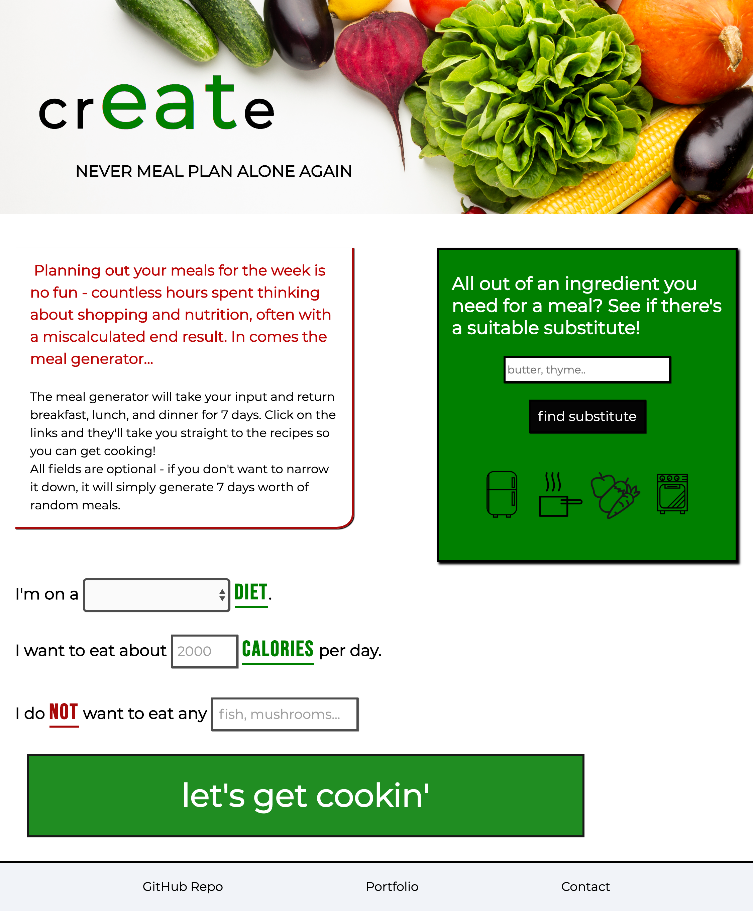
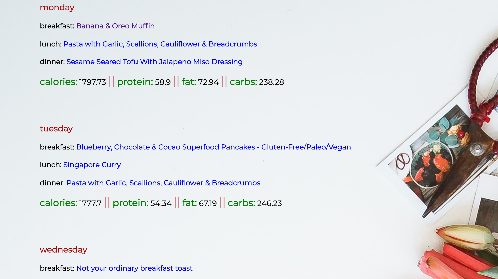
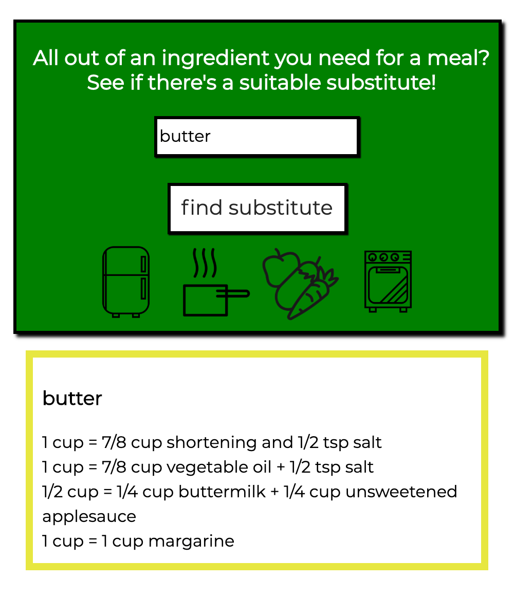

# Meal Generator App
---
[Live App](https://rmac2289.github.io/mealGenerator/)

---

#### This app allows the user to plan out a week's worth of meals based on their desired caloric intake, special diet, and food restrictions using calls to the spoonacular API. 

The user enters input for these fields and the generator will display breakfast, lunch, dinner, and daily nutritional information for every day of the week. 

The app also allows the user to input an ingredient that they need for a recipe, and find a suitable substitute that they can use instead of that ingredient.

### Built with 
 ---
* HTML/CSS
* JavaScript
* jQuery

### Screenshots
---
##### Landing page: 

##### Meal input response:

##### Ingredient input response:

